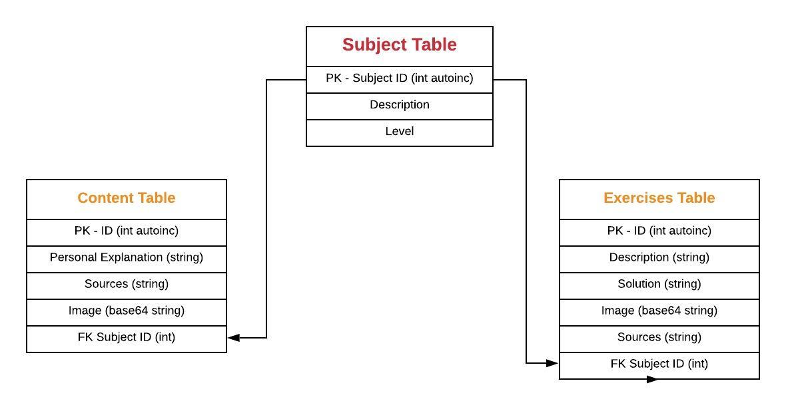

# Learning Math Again

If you want to start over, you've come to the right repository. Now that I'm almost 30 
years old I just realized Math is cool and it's time to understand it and make it 
available for free.

### Content
- Api EP with Exercises
- Api EP with Lectures
- Journal on my Roadmap

### Personal Goals
- Practice English On Journals
- Improve my Pythonic/Flask Skills
- Math? :tada:

### Journal

Running a basic flask api with an index render, the initial db Schema:

Basic CRUD to start implementing data as I learn the basics in the process.

